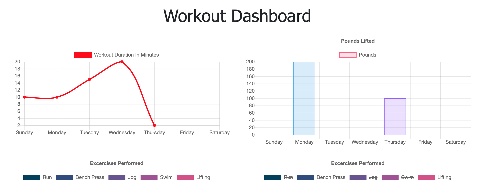

[](https://www.gnu.org/licenses/gpl-3.0)
  # Workout Tracker

  

  ## Table of Contents
  * [Description](#description)
  * [Installation](#installation)
  * [Usage](#usage)
  * [Contributing](#contributing)
  * [Tests](#tests)
  * [Questions](#questions)
  * [License](#license)

  ## Description
  I was tasked with building out a functional back end server for the fitness tracker app utilizing the NoSQL database MongoDB. A user can add workouts and exercises to the site and information is stored in Mongo. Mongoose was used in Node to query the database. Two Mongoose models were created to handle the stored data: Workout and Exercise. The schema for Workout is as follows:
  ``` Javascript
const WorkoutSchema = new Schema({
  day: {
    type: Date,
    default: Date.now
  },
  exercises: [
    {
      type: Schema.Types.ObjectId,
      ref: "Exercise",
    },
  ],
}
  ```
And for Exercise:
```Javascript
const ExerciseSchema = new Schema({
    type: {
        type: String,
        required: true,
        enum: ["cardio", "resistance"]
    },
    name: {
        type: String,
        required: true,
    },
    duration: {
        type: Number,
        required: true,
    },
    weight: {
        type: Number,
    },
    reps: {
        type: Number,
    },
    sets: {
        type: Number,
    },
    distance: {
        type: Number,
    }
});
```
  ## Installation
  A package.json is included in the repo to allow a simple ```npm i``` to install all necessary dependencies.
  ## Usage
  The following is a link to the deployed site:
  
  [Workout Tracker](https://workout-tracker-joseph.herokuapp.com/)
  ## Contributing
  The following packages were used in deploying this application: Express, Mongoose, and Morgan.
  ## Tests
  N/A
  ## Questions
  Github profile: [dgtlctzn](https://github.com/dgtlctzn)
  
  If you have any questions about the project please contact josephperry@gmail.com
  ## License
  This project is covered under the GNU license
